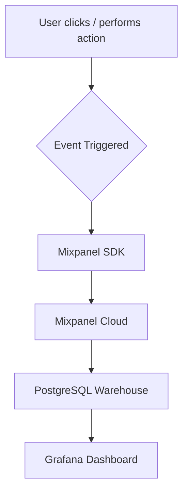

# Analytics Implementation Plan

**Team:** Vertex  
**Date:** November 6, 2025  
**Product:** Learning Management System – LMS-Vertex  
**Timeline:** Weeks 6–8  

---

## Executive Summary

**Purpose:**  
This plan defines how analytics will be implemented for **LMS-Vertex**, a university platform for schedules, grades, course materials, registration, and assignments.  
The goal is to measure engagement, usage, and performance across core features to make data-driven design decisions.

**Key Decisions:**
- **Analytics Platform:** Mixpanel (Free Tier)
- **Implementation:** Frontend (React) + Backend (Node.js)
- **Timeline:** 3 weeks (Week 6–8)
- **Success Criteria:** All core events tracked and visible in dashboards by the end of Week 8

---

## Goals & Success Criteria

### Primary Goals
1. **Track North Star Metric:** Weekly Active Students (WAS)  
2. **Monitor Funnel:** Registration → Course Enrollments → Homework Submission → Grade View  
3. **Enable Data-Driven Decisions:** Weekly dashboard review  
4. **Ensure Data Quality:** ≥95% event success rate  

**Success Criteria**

| Criterion | Target | How Measured |
|-----------|--------|---------------|
| Event Coverage | 8 core events | Event count |
| Data Accuracy | <5% event loss | Sent vs received |
| Dashboard Latency | <1 min delay | Test event → dashboard |
| Team Adoption | 100% weekly use | Dashboard access logs |
| Performance Impact | <50 ms latency | Browser profiling |

---

## Analytics Architecture

### Data Flow



Example Flow:  
When a student uploads homework, the frontend triggers `homework_uploaded`. The Mixpanel SDK validates and sends it to Mixpanel. Events sync to PostgreSQL nightly, and Grafana visualizes engagement and completion statistics.

### Technology Stack

| Component | Tool | Reason |
|------------|------|--------|
| Analytics Platform | Mixpanel | Visual dashboards, free tier, fast setup |
| Data Warehouse | PostgreSQL | Already part of LMS backend |
| Visualization | Grafana | Free, open-source, connects to PostgreSQL |
| Client SDK | Mixpanel JS SDK 2.0 | React frontend tracking |
| Backend Tracking | Mixpanel Node.js SDK | Server-side events |

### Alternatives Considered

| Option | Pros | Cons | Why Not Chosen |
|---------|------|------|----------------|
| Google Analytics | Free, easy | Limited event customization | Not suited for product analytics |
| Amplitude | Powerful UI | Paid tiers expensive | Budget limitation |
| Custom Tracking | Full control | Time-intensive | Slows MVP release |

---

## Implementation Timeline

### Week 6 – Setup
- Create Mixpanel project  
- Install SDKs (frontend + backend)  
- Configure dev / prod environments  
- Implement first events (`user_signed_up`, `login_success`)  
- Verify data in Mixpanel  

### Week 7 – Core Tracking
- Add key events (`course_enrolled`, `material_viewed`, `homework_uploaded`, `grade_viewed`)  
- Connect Mixpanel → PostgreSQL  
- Build initial Grafana dashboard  
- Validate schema + properties  

### Week 8 – Launch
- Deploy analytics code  
- Monitor for 3 days  
- Finalize dashboards (North Star + Funnel)  
- Team training on data use  
- Documentation complete  

---

## Technical Implementation

### Frontend (React)

**Install**
```bash
npm install mixpanel-browser
```

**Setup**
```javascript
import mixpanel from 'mixpanel-browser';
mixpanel.init('YOUR_PROJECT_TOKEN', { debug: true });

export function trackEvent(eventName, props = {}) {
  mixpanel.track(eventName, {
    ...props,
    timestamp: new Date().toISOString(),
    platform: 'web'
  });
}
```

**Usage Example**
```javascript
trackEvent('homework_uploaded', {
  course_id: 'CS102',
  file_size_mb: 2.1
});
```

### Backend (Node.js)

**Install**
```bash
npm install mixpanel
```

**Setup**
```javascript
const Mixpanel = require('mixpanel');
const mixpanel = Mixpanel.init(process.env.MIXPANEL_TOKEN);

function trackServerEvent(userId, eventName, props = {}) {
  mixpanel.track(eventName, {
    distinct_id: userId,
    ...props,
    source: 'backend'
  });
}

module.exports = { trackServerEvent };
```

---

## Event Implementation Checklist

| Event | Description | Status |
|--------|--------------|--------|
| user_signed_up | Account created | ☐ |
| login_success | Successful login | ☐ |
| course_enrolled | Student joins a course | ☐ |
| material_viewed | Course material opened | ☐ |
| homework_uploaded | Assignment submitted | ☐ |
| grade_viewed | Grade page opened | ☐ |
| forum_post_created | Forum post submitted | ☐ |
| session_duration_logged | Study session time tracked | ☐ |

---

## Dashboard Design

### North Star Metric Dashboard
**Metrics**
- Weekly Active Students  
- Avg Session Duration  
- Homework Submissions per Week  
- Grade Views per Course  

### AARRR Funnel Dashboard
- Signup Started → Completed  
- Course Enrollment  
- First Material View  
- Homework Submission  
- Grade Viewed  

_Target conversion per step ≥ 60 %._

---

## Data Quality & Monitoring

- Validate required event properties  
- Daily check event delivery rate  
- Alerts if > 10 % loss  
- Weekly backup of dashboard metrics  

---

## Team Responsibilities

| Role | Member | Responsibility |
|------|---------|----------------|
| Analytics Lead | Murman Gorgadze | Mixpanel setup & data validation |
| Tech Lead | Demetre Mikeladze | SDK integration & backend tracking |
| Data Analyst | Aleksandre Dididze | Grafana dashboards |
| QA Tester | Avtandil Ananidze | Event firing & accuracy checks |
| Documentation | Lekso Potskhverashvili | Maintain analytics docs |

---

## Privacy & Compliance

- Data sent via HTTPS only  
- No personal identifiers collected  
- Clear privacy notice for users  
- Option to disable tracking in Settings  

---

## Launch Checklist

- [ ] 8 core events implemented  
- [ ] Mixpanel dashboard operational  
- [ ] Grafana connected to PostgreSQL  
- [ ] Alerts configured  
- [ ] Team trained  
- [ ] Privacy policy updated  

---

## Maintenance Plan

- **Weekly:** Check dashboards + accuracy  
- **Monthly:** Audit schema + data loss  
- **As needed:** Add events for new features  

---

## Success Metrics (for Analytics itself)

| Metric | Target |
|--------|--------|
| Event coverage | 100 % of core flows |
| Data accuracy | <5 % loss |
| Dashboard usage | ≥5 views per week |
| Time to insight | <5 minutes |
| Data-driven decisions | ≥80 % team usage |

---

## Risks & Mitigation

| Risk | Likelihood | Impact | Mitigation |
|------|-------------|---------|-------------|
| Events not firing | Medium | High | QA testing in staging |
| Wrong data types | Medium | Medium | Schema validation |
| Dashboard ignored | Medium | High | Weekly review ritual |

---

## Future Improvements

- Cohort analysis by course type  
- Retention & engagement prediction  
- Mobile analytics tracking  
- Slack alerts for metric drops  

---

## Team Sign-Off

- Aleksandre Dididze – 11 / 06 / 2025  
- Avtandil Ananidze – 11 / 06 / 2025  
- Murman Gorgadze – 11 / 06 / 2025  
- Demetre Mikeladze – 11 / 06 / 2025  
- Lekso Potskhverashvili – 11 / 06 / 2025  
